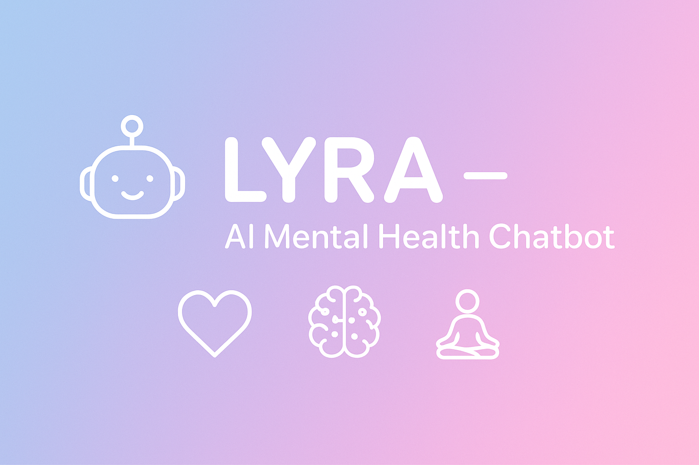

<h1 align="center">🌸✨ LYRA – AI-Powered Mental Health Chatbot For Window Application ✨🌸</h1>

<p align="center">
  <em>"Because sometimes, you just need someone who listens."</em> 💬💖  
</p>

<p align="center">
  
</p>

---

<p align="center">
  
  
  
  
  
</p>

---

## 🧠 **Overview**

Meet **Lyra**, an intelligent **AI chatbot** designed to **support mental wellness** using the power of **Natural Language Processing (NLP)**.  
Lyra listens, understands emotions, and responds with empathy — helping users deal with stress, loneliness, and anxiety in a comforting, conversational way.  

💡 *This project was created to blend technology with emotion – AI that cares.*  

---

## 🌟 **Key Features**

| 🌈 Feature | 💬 Description |
|------------|----------------|
| 🧩 **NLP-Powered Understanding** | Lyra uses AI to understand natural language and human emotions. |
| 💖 **Empathetic Conversations** | Provides comforting and mood-based responses for better mental health. |
| 🧘 **Stress & Emotion Support** | Suggests relaxation ideas and positivity-boosting messages. |
| ⚡ **Fast & Lightweight** | Built with Flask and simple web technologies for instant response. |
| 🎨 **Beautiful UI** | Smooth, minimal interface made with HTML, CSS, and JS. |
| Integrated with Electron JS |
| displaying with the gitpush on the render on the Windows |

---

## 🧰 **Tech Stack**

| Category | Technology |
|-----------|-------------|
| 🧠 **AI / NLP** | NLTK, SpaCy, Transformers (HuggingFace) |
| 💻 **Backend** | Python (Flask Framework) |
| 🎨 **Frontend** | HTML, CSS, JavaScript |
| ☁️ **Deployment** | Render / Heroku / GitHub Pages |
| 🔧 **Version Control** | Git & GitHub |

---

## 🗂️ **Project Structure**

Lyra-Chatbot/
│
├── app.py # Main Flask backend
├── static/
│ ├── style.css # Chatbot UI design
│ └── script.js # Chat functionality
│
├── templates/
│ └── index.html # Web interface
│
├── requirements.txt # Python dependencies
└── README.md # Project documentation

---

## ⚙️ **How to Run the Project Locally**

### 🧭 Step 1: Clone the Repository
```bash
git clone https://github.com/<your-username>/Lyra-Chatbot.git
cd Lyra-Chatbot
💬 Sample Conversations
🧍‍♀️ User: “I feel anxious lately.”
🤖 Lyra: “It’s okay to feel that way 🌱. Take a deep breath — you’re doing your best.”
🧍‍♂️ User: “I’m so happy today!”
🤖 Lyra: “That’s amazing! Keep smiling, your joy brightens the world ☀️💛.”
🖼️ Preview
<p align="center">  </p>

🌍 Connect & Contribute
⭐ Star this repo if you like the project!
💡 Feel free to contribute via pull requests and suggestions.
Together, let’s make mental health support smarter and kinder. 💚
<p align="center"> <a href="https://github.com/<your-username>/Lyra-Chatbot">  </a> </p>
<h3 align="center">🌸 LYRA – Where Technology Meets Empathy 🌸</h3> <p align="center">Made with ❤️ using AI, Flask, and a lot of care.</p> ```
